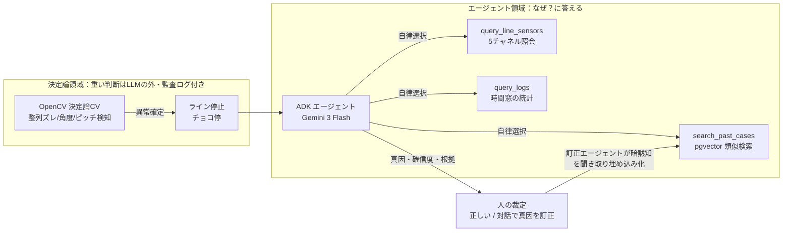
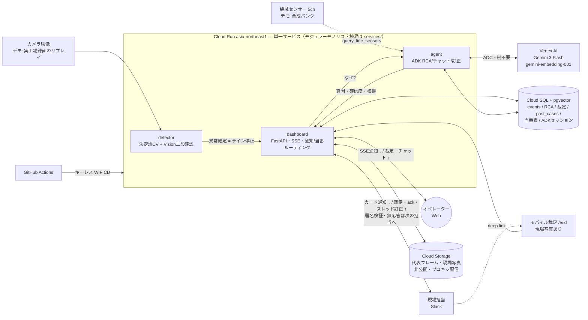

# e-Andon — AIアンドン：工場ライン見える化 × AI自律原因推定

[](https://github.com/ai-club-lab/e-andon/actions/workflows/ci.yml)

**稼働URL: https://chokotei-dashboard-523085315022.asia-northeast1.run.app**
（Cloud Run asia-northeast1。審査期間中は min-instances=1 で待機、以降 scale-to-zero）

生産ラインの「**チョコ停**」（部品の位置ずれ等で起きる微小な短時間停止）は、現場では
「止まったことは分かるが、**なぜ**かは人が調べる」もの。e-Andon は従来のアンドン（異常表示灯）を
AIエージェントで拡張し、**検知 → 停止 → 原因推定 → 人の裁定 → 次回の推論改善** を1本の閉ループにする。


*↑ 実映像デモ: 部品が流れる → 整列ズレ検知（赤枠 offset 16px）→ ライン停止 → **AIエージェントが
「センサーは全て正常＝位置決め機構側の問題」と絞り込み、真因・確信度・根拠を通知** → 人が「正しい/違う」を裁定。*

> **デモ環境の構成（正直な開示）**: 組立ライン1は**実工場の録画映像のリプレイ**＋**合成センサーバンク**
> （seed固定。整列異常は映像でしか捉えられない想定のため、センサーは「正常」の文脈を担う）。
> 実IoTへの接続は `iot_store` の1箇所差し替え。他3ラインはUI上も「デモ」表示の合成波形。

## 何が痛いのか（インパクト試算）

チョコ停は TPM の設備「7大ロス」の一つ。1回は数分でも積み重なると大きく、
例えば計画稼働 480分/日のラインでチョコ停合計60分なら**それだけで稼働率 ▲12.5%**
（[チョコ停の損失計算とOEE](https://www.me-toyo.co.jp/news/chokotei/)）。
現場の実情は「復旧は数分、**原因調査は人が設備を見て回って数十分〜翌日持ち越し**」。
e-Andon はこの初動調査（どのセンサーを見るか・過去に同じことがなかったか）を、
停止通知と同時に**真因候補・確信度・根拠つきで数十秒に短縮**する。検知そのものの品質は
実映像241フレームで**誤検知0・異常1件を毎pushの回帰テストで担保**（[CI](.github/workflows/ci.yml)）。

## なぜ「AIエージェント」なのか（必然性）



- **停止判断は決定論**: 異常確定・ライン停止は OpenCV の幾何計算（閾値は PoC 実測: 正常σ≈1px vs 異常18px）。
  LLM に破壊的判断をさせない（ガードレール）。境界帯 (8–12px) だけ Gemini Vision が二段確認。
- **「なぜ」はエージェントでしか解けない**: 位置決め機構はセンサー非搭載＝ログを1本引けば済む問題ではない。
  エージェントが**自分でツールを選び**、5つの機械センサーを照会 →「全て正常」を**消去法の根拠**に変換 →
  過去事例をベクトル検索して真因を絞る。この探索・統合・推論の連鎖が Function Calling の自律ループ。
  通知にはエージェントが選んだ**ツール呼び出しの履歴**（例: `query_line_sensors → search_past_cases`）を
  根拠と併記する——自律性は主張でなく証跡で示す。チャットはセッション永続（Cloud SQL）で**マルチターン**。
- **使うほど賢くなる（対話で暗黙知を回収）**: 推定が外れたとき、オペレーターはフォーム入力ではなく
  **AIエージェントとの自然な対話**で真因を伝える。専用の訂正エージェントが現場の見立てを1〜2往復で聞き出し、
  `record_correction` ツールで確定 → Gemini Embedding で埋め込み → Cloud SQL (pgvector) に事例化 →
  次回 RCA の few-shot に自動還流。書き込み先イベントはサーバが固定（LLMは原因テキストのみを供給）し、
  監査ログに残す（ガードレール）。正答率は `/metrics` で追跡。

### 学習ループの実測（Before / After）

`/feedback` と同一のコードパスで、**訂正1件が次回推論を変える**ことを実測した（Vertex 実呼び出し）:

| | AIの第一候補 |
|---|---|
| **Before** — 初見の横ズレ異常 | 「位置決め治具の摩耗・ガタによる整列精度低下」 |
| **HITL** — 現場が「違う」と対話で真因を伝える | 「搬送ガイドレール固定ボルトの緩みによる横ズレ」 |
| **After** — 類似異常の再発時 | **「搬送ガイドレール固定ボルトの緩みによる横ズレ」**（訂正が第一候補に） |

訂正は埋め込み化されて `past_cases` に還流し、`rca_cache` の該当シグネチャを無効化するため、
同種の異常が再発した瞬間から推論が変わる。これが本作品の「まわす」= AIを継続的に改善するサイクル。

この実験は [scripts/loop_experiment.py](scripts/loop_experiment.py) で誰でも再現できる
（`/feedback` と同一の還流ロジック・一時ディレクトリのローカルストア使用・本番データ不変）:

```bash
PYTHONPATH=services/agent python scripts/loop_experiment.py   # 要ADC・Vertex実呼び出し×2
```

## アーキテクチャ



映像を検知した detector がラインを止め、dashboard が**当番表の担当者に名前で通知**、agent が「なぜ」を
推論して根拠つきで返す。人の裁定・訂正・現場写真は Cloud SQL に事例化され、次回の推論を変える（閉ループ）。
3モジュールは**1コンテナ**で動く（分割点は `services/` 境界に確保、下記「デプロイ形態」参照）。

```
services/detector    決定論CV検知（整列/角度/ピッチ）＋ Gemini Vision 二段確認 ＋ 時系列集約
services/agent       ADK RCAエージェント（FunctionTools・DatabaseSessionService・埋め込み検索）
services/dashboard   FastAPI＋軽量フロント（稼働1ライン＋デモ表示3ライン・SSE・チャット・HITL・コールドスタート復元）
                     ＋人間側ループ: Slack通知/裁定/訂正（署名検証）・原因カテゴリ→当番表の決定論ルーティング
                     （「誰に通知したか・無応答なら次に誰か」を名前で明示）・「👋 私が対応します」は
                     当番チップ1タップで実名確定し全面（Web/Slack/モバイル）に数秒で同期・
                     モバイル裁定 /e/{id}・分析ビュー /analytics（SLACK_* 未設定なら従来どおり動作）
packages/shared      型付き契約(pydantic)・設定注入・構造化ログ(obs)
infra                Cloud SQL スキーマ・WIFセットアップ
.github/workflows    CI（テスト＋Dockerビルド）／CD（キーレスWIFデプロイ）
```

- **実行**: Cloud Run / **AI**: Vertex AI Gemini 3 Flash + gemini-embedding-001（ADC・鍵不要, global エンドポイント）
  - **モデルライフサイクル管理**: 初期実装の gemini-2.5-flash は **2026-10-16 提供終了が確定**したため、
    ADK 2.3 の新デフォルトに追随して gemini-3-flash へ移行済み（`GEMINI_MODEL` 環境変数で即ロールバック可）。
    廃止予定モデルを本番に残さない運用も「まわす」の一部。
- **状態**: Cloud SQL Postgres + pgvector（イベント・RCA・過去事例ベクトル・ADKセッション永続化）
- **エージェント**: google-adk==2.3.0（**2026-06-18 リリースの現行最新**・バージョン固定・セッション永続化 smoke test 済み）
- **デプロイ形態はモジュラーモノリス（意図的）**: `services/` はモジュール境界（契約は `packages/shared` の
  pydantic 型）で分離しつつ、この規模では1コンテナ・**ステートフル・シングルトン**（`--min-instances=1
  --max-instances=1` 明示）で運用する。インメモリの推論キャッシュ・レート制限・SSEを単一インスタンスに
  閉じ込める宣言であり、複数ライン監視に伸ばす際は detector を Cloud Run **worker pools** に切り出す
  （分割点は `services/` 境界に既に引いてある）。
- **なぜ Vertex AI Vector Search でなく pgvector か**: 過去事例はライン単位で高々数百〜数千件で、
  イベント・裁定・ADKセッションと**同じ Cloud SQL に同居**させると学習ループが1トランザクション空間で閉じ、
  追加の常駐コストもゼロ。この規模なら逐次スキャンの cosine で十分速く、埋め込みは
  gemini-embedding-001 を **768次元（MRL）**で使い pgvector の HNSW 2000次元制限とも無縁。
  事例が万単位に伸びたら Vector Search 2.0 へ移行する前提で、検索は `search_past_cases`
  ツール1箇所に隔離してある（差し替え点が1つ）。
- 仕様駆動: [.kiro/specs/chokotei-anomaly-rca/](.kiro/specs/chokotei-anomaly-rca/)（requirements → design → tasks を全トレース）

### 採用しなかった選択肢（技術判断）

- **Vertex AI Agent Engine**: エージェント単体のホスティングには最も楽なパスだが、本作は
  ダッシュボード（SSE＋HITL UI）と一体のプロダクトで、Agent Engine を使っても dashboard 用の
  Cloud Run は残る。セッション永続化は `DatabaseSessionService` で先に確保済み。
  ADK コードはそのまま Agent Engine に載る構成なので、分離が割に合う規模になったら移行できる。
- **マルチエージェント編成（A2A / transfer_to_agent）**: RCA・チャット・訂正の3エージェントは
  役割ごとに**セッション境界で分離**しており、単一ドメインに階層編成やエージェント間プロトコルを
  持ち込む必然性がない。`transfer_to_agent` は文脈を落とす一方向遷移のため不採用（FunctionTools で制御を保持）。
- **AlloyDB（ScaNN インデックス）**: 事例が万単位になり HNSW/ScaNN が要る規模までは、
  Cloud SQL の運用単純さ・低コストが勝つ。両者とも pgvector 互換なので移行コストは低く、
  切り替え判断を規模のシグナル（検索レイテンシ）に委ねられる。

## つくる・まわす・とどける

- **つくる**: 上記。決定論CVとエージェントの役割分離が設計の核。
- **まわす** — CI/CD・可観測性:
  - **CI** ([ci.yml](.github/workflows/ci.yml)): 毎 push/PR で決定論CVテスト・**UIテスト（チャット/HITL裁定/メトリクス）**・コンパイル健全性・本番同一イメージの Docker ビルド。
  - **CD** ([deploy.yml](.github/workflows/deploy.yml)): **キーレス（Workload Identity Federation）**で `main` → Cloud Run 自動デプロイ。長期SAキーは発行しない。
    リードタイムは **main push → 本番反映 約3分**（直近の実測: 2m24s / 3m04s）。
  - **可観測性** ([docs/observability.md](docs/observability.md)): 構造化JSONログ（Cloud Logging で severity / event_id フィルタ可能）、
    HITL正答率 `/metrics`、Cloud Run 標準メトリクス。監査証跡（検知→根拠→裁定）はすべて Cloud SQL に残る。
  - **Four Keys（デリバリのまわり方）**:

    | 指標 | 本作品での実現 |
    |---|---|
    | デプロイ頻度 | `main` への push ごとに自動デプロイ（WIF → Cloud Run） |
    | 変更リードタイム | **push → 本番反映 約3分**（実測 2m24s / 3m04s） |
    | 変更障害率 | 毎 push の CI（決定論CV・UI・コンパイル・Dockerビルド）を通過後にのみデプロイ。異常確定は決定論CVに隔離しLLMの回帰から保護 |
    | 復元時間(MTTR) | Cloud Run のリビジョン即時ロールバック＋コールドスタート時に Cloud SQL から状態復元。停止経過時間はUIに常時表示 |
- **とどける**: 上の稼働URLで誰でも動作確認可能。コールドスタート後も Cloud SQL から状態復元し、審査期間は min-instances=1 で待機なし。

## ローカル開発

```bash
python3 -m venv .venv && source .venv/bin/activate
pip install -e packages/shared
pip install -r services/detector/requirements.txt   # 必要なサービスごと
# オフラインテスト（GCP認証不要・動画パスはリポジトリ直下基準）
PYTHONPATH=services/detector python -m pytest -q services/detector/test_detection.py services/detector/test_guardrails.py
# UIテスト（チャット / HITL裁定 / メトリクス — Vertexはモック）
PYTHONPATH=services/dashboard:services/agent:services/detector python -m pytest -q services/dashboard/test_server.py
```

## ガードレール（公開repo前提）

- APIキー/SAキー/`.env` は公開repoに入れない（**Secret Manager / ADC / WIF**）。
- 重い意思決定（異常確定・停止）は**決定論CV**に置き、LLMの外＋監査ログに（HITL）。詳細: [docs/audit.md](docs/audit.md)
- `gcloud projects delete` / `run services delete` は打たない（撤収は owner 判断）。

> 補足: Cloud Run サービス名・内部パッケージ名は旧称 `chokotei` のまま（稼働URL維持のための意図的判断）。
> プロダクト名・UIは e-Andon に統一している。
