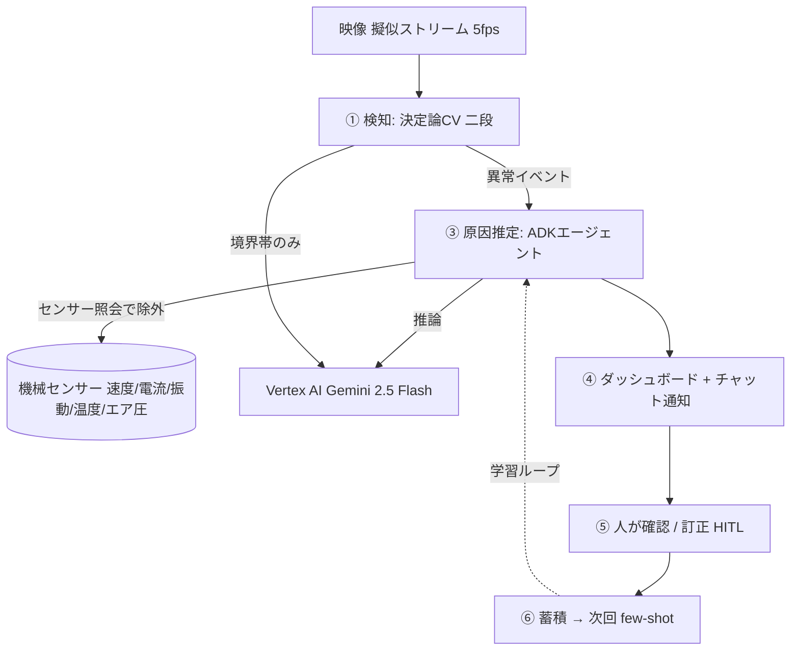

工場の生産ラインで、部品が一瞬だけ引っかかって止まる。数十秒で復帰するので誰も気に留めない。でも1日に何十回も積み重なると、無視できない稼働率の低下になる——これが「**チョコ停**（ちょこてい／微小な短時間停止）」です。

厄介なのは「起きたこと」より「**なぜ起きたか**」の特定に時間がかかること。異常を見つけるだけのシステムは山ほどありますが、現場が本当に欲しいのは「その原因は何で、次に何をすればいいか」です。

このハッカソン（DevOps × AI Agent、2026年）では、そこを**1本の閉ループ**にしました。映像から整列異常を**決定論CV**（コンピュータビジョン）で検知し、**AIエージェント**が機械センサーを照会して（すべて正常＝過負荷等を除外し）真因を推定、チャットで通知し、人が正誤を確認・訂正して蓄積、次回の推論に還す（**HITL: Human-in-the-Loop**）。工場の複数ラインを1画面で見える化し、GCP 上で稼働URLまで到達しています。

本記事は、その設計判断（特に「**どこをLLMに任せ、どこを任せないか**」）と、実際に踏んだ地雷を実装解説としてまとめたものです。

:::message
審査軸が徹頭徹尾エンジニアリング（DevOps / SDLC）だったので、「動く稼働URLを落とさない」「重い意思決定は決定論側に置く」を最優先に設計しています。
:::

## 1. 何を作ったか

本作 **e-Andon** は、製造の「**アンドン**」（異常を知らせ、必要ならラインを止める信号システム）の現代版です。異常を**検知して知らせる**だけでなく、AIが**"なぜ"まで答える**——そこが従来のアンドンとの違いです。

俯瞰カメラの映像で、ダークなベルト上を四角い金属部品が等間隔・同一向きで流れていきます。ここで **1個だけ整列から外れる**（上方向へズレる／回転する）と、それがチョコ停の予兆です。

作ったシステムの流れはこうです。



ポイントは処理の**役割分担**です。異常の「確定」は決定論CVが行い、LLM/エージェントは「原因の推論と説明」だけを担当します。この線引きが、本作の背骨です。

## 2. 設計判断：異常が「幾何的」だから、検知はLLMに任せない

まず動画のフレームを何枚か抜いて観察しました。すると異常は「キズ・欠け」のようなテクスチャ欠陥ではなく、**規則格子からの幾何的な逸脱**だと分かりました。等間隔・同じ向きに並んだ部品の中で、1個だけ位置や角度がズレる。

幾何的な逸脱は、**重心座標・回転角・隣接間隔**という数値で厳密かつ説明可能に測れます。ここにLLMを使う理由はありません。むしろ：

- 学習不要・GPU不要・軽量で、Cloud Run のスケールゼロと相性が良い
- **なぜ異常かを数値で言える**（監査ログに残せる）
- ガードレール「重い意思決定はLLMの外（決定論ロジック）＋監査ログ」に合致する

そこで検知は OpenCV による決定論処理にしました。ROI（ベルト帯）を Otsu で二値化し、各部品を輪郭抽出して重心と `minAreaRect` の角度を取り、フレーム内の中央値からの逸脱で判定します。

```python
# services/detector/detection.py（抜粋）
base_y, base_ang = float(np.median(ys)), float(np.median(angs))
for p in parts:
    off = p.cy - base_y                    # 行の中心線からの縦オフセット
    if abs(off) > cfg.offset_px:           # 既定 10px
        flags.append(FlagDetail(kind="offset", cx=p.cx, cy=p.cy,
                                magnitude=abs(off), reason=f"offset {off:+.0f}px"))
    dang = p.angle - base_ang              # 整列向きからの回転
    if abs(dang) > cfg.angle_deg:
        flags.append(FlagDetail(kind="rotation", ...))
```

PoC（概念実証）で実測したところ、正常ラインは **cy のばらつき σ≈1px / 角度 σ≈1°** と極めて安定。対して実際の異常は **1個の部品が約18px 上方へ変位**していました。雑音2px弱に対し異常18pxなので、閾値10pxでも十分なマージンがあり、100フレーム走査して**誤検知ゼロ**でした。

:::message
「まずPoCで技術的成立性を握ってから仕様を固める」順で進めたので、後段の手戻りがほぼありませんでした。仕様駆動（Requirements → Design → Tasks）と相性が良いです。
:::

### 二段目：境界帯だけ Gemini Vision で確認

決定論だけだと、閾値ギリギリのグレーゾーンで判断が硬くなります。そこで**境界帯（オフセット8〜12px）に入ったときだけ**、切り出し画像を Gemini 2.5 Flash に投げて「整列が乱れているか」を yes/no で確認する二段構えにしました。明確な異常はCVで即確定するので、モデル呼び出しは稀にしか発生せず、コストとレート制限（429）を抑えられます。

```python
# 異常部品の切り出し → Vertex の Gemini に yes/no を問う
verdict = resp.text.strip().upper()   # "YES" / "NO"
return verdict.startswith("YES")      # 失敗時は fail-open（異常を握り潰さない）
```

実測でも、変位した部品の切り出し → `YES`、正常な部品 → `NO` と正しく判別できました。

## 3. 原因推定：ADKエージェントが「センサーで除外し、上流の真因を指す」

異常が確定したら、**なぜ**の推論（RCA: Root Cause Analysis、原因分析）に入ります。ここでエージェントの出番です。基盤は Google の **Agent Development Kit (ADK)**、モデルは Vertex AI の Gemini 2.5 Flash（**ADC: Application Default Credentials による認証なのでAPIキー不要**）。

マルチエージェントの制御を保つため、`transfer_to_agent`（一方向で文脈を落とす）ではなく **AgentTool / FunctionTool（agents-as-tools）** 構成にしました。ルートをオーケストレータにして、専門機能をツールとして持たせます。

```python
# services/agent/rca_agent.py（抜粋）
agent = Agent(
    name="rca_orchestrator",
    model="gemini-2.5-flash",
    instruction=_INSTRUCTION,      # 「センサーが正常か確認→上流の位置決め機構を真因に」
    tools=[query_line_sensors, query_logs, search_past_cases, get_frame],
)
```

ここで肝心なのが**推論の向き**です。整列異常はカメラでしか捉えられません（部品を並べる位置決め機構はセンサー非搭載）。そこでエージェントには、機械センサー（ベルト速度・モータ電流・振動・温度・エア圧）を照会させ、**すべて正常なことを確認して「過負荷や噛み込みではない」と除外**し、消去法で上流の機械的な位置決め機構を真因として指させます。IoT実機はないので、映像タイムラインに整合した**正常帯の合成センサー**を生成しています。

実際に稼働URLで動かすと、エージェントはこう返してきました。

> 真因: **部品供給位置の微小なずれ / 位置決め治具の取り付けずれ**（確信度 80%）
> 根拠: offset 17.0px（映像で検知）; belt_speed 平均11.99・motor_current 平均2.996 はいずれも正常範囲

「映像で17pxのズレを検知 → でも電流も速度も正常 → だからセンサーに出ない位置決め機構が真因」。**症状（画像）から、センサーで裏を取りつつ、上流の真因へ遡る**——これがこのエージェントの価値です。指示に「センサーが正常なら過負荷ではないと判断し、上流を疑え」と一文足すだけで、この消去法推論が安定しました。

:::message
一度は「ズレ→振動スパイク」「ズレ→噛み込みでモータ電流上昇」という因果も試しましたが、**単に1個ズレただけでベルト電流は上がらない**という現場感覚のフィードバックで見直しました。物理的な妥当性を詰めるほど、AIの推論も素直で説得力のあるものになります。
:::

## 4. HITL：訂正を蓄積して次に活かす（そして本番で見つけたバグ）

推定はあくまで推定なので、人が「正しい／誤り」を判定します。誤りなら正しい原因を入力してもらい、`feedback` に記録。さらにその訂正を `past_cases` に還流させ、次回の原因推定で**優先的に検索される few-shot 事例**にします。これで同じ誤りを繰り返しにくくなります。

ここで**Cloud Run 本番で顕在化したバグ**があります。当初、異常イベントの状態をアプリのメモリ内に持っていました。ローカルでは完璧に動くのに、本番で `/feedback` を投げると「該当イベントがない」と弾かれる。

原因は、Cloud Run が**複数インスタンス**になりうること。`/stream`（検知したインスタンスA）と `/feedback`（別インスタンスB）が別プロセスに当たると、Bのメモリにはそのイベントが存在しません。**メモリ内状態は本番で分断される**——という、分散システムでは基本ですが、ローカル開発では見えない類の落とし穴でした。

修正は、イベント・RCA・feedback・past_cases をすべて **Cloud SQL に永続化**し、`/feedback` の検証もDB経由にすること。これでインスタンスに依存せず、コールドスタートを跨いでも学習履歴が残ります。

```python
# /feedback: メモリではなくDBでイベントを検証（インスタンス非依存）
rec = event_store.get_event(event_id) if db.enabled() else state.events.get(event_id)
if verdict == "wrong":
    pc.add(FeedbackCase(summary=..., correct_cause=human_cause, ...))  # 次回 few-shot へ還流
```

## 5. インフラ配線とハマりどころ（de-risk）

GCP の標準スタックで組みました。

| 層 | 採用 | 理由 |
|---|---|---|
| 実行基盤 | Cloud Run（min-instances=0） | 待機コストゼロ（スケールゼロ） |
| AI | Vertex AI Gemini 2.5 Flash | ADC で鍵不要・us-central1 |
| 状態 | Cloud SQL（Postgres + pgvector） | セッション永続・学習ループ・RAG |
| 画像 | Cloud Storage（非公開バケット） | 代表フレーム保存＋プロキシ配信 |
| 秘密 | Secret Manager | DBパスワードを repo に置かない |

初日に潰しておくべき地雷（de-risk）を先に片付けたのが効きました。踏んだものを正直に共有します。

**① ADK のセッション永続（最重要）**
ADK の既定はインメモリで、Cloud Run ではインスタンス毎に履歴が消え、ユーザーが混線します。`DatabaseSessionService` で Cloud SQL に永続化しますが、ADK 2.x は **async ドライバ必須**で、接続URLは `postgresql+asyncpg://`（`postgresql://` では動かない）。別サービスインスタンスから同じセッションを読み戻せることをスモークテストで確認して、初めて「クリア」としました。

**② Cloud Run デプロイの403とビルド失敗**
`--source` デプロイで連続してコケました。

- `opencv-python-headless==5.0.0` が「見つからない」→ 実際のパッケージ版は **4桁の `5.0.0.93`**（`cv2.__version__` の "5.0.0" 表記に釣られた）
- `fastapi==0.115.6` が `google-adk==2.3.0` と**依存衝突**→ adk が要求する `fastapi>=0.133` に合わせて `0.139.0` へ
- ランタイムSA（compute, editor ロール）が**Secretにアクセスできず** Revision 作成失敗 → `roles/editor` は Secret Manager accessor を含まないので、シークレットに `secretmanager.secretAccessor` を明示付与

**③ 決定論判定＝監査可能**
異常確定は決定論CVなので、`anomaly_events`（検知の事実）と `rca_results.evidence`（推論が参照した数値）を残せば、誰が・いつ・何を根拠に判断したかが追えます。重い意思決定はLLMの外に置く、を構造で担保しました。

**④ CI/CD はキーレス（Workload Identity Federation）**
GitHub Actions → Cloud Run のデプロイは、長期SAキーを発行せず **WIF（OIDC）** で行います。ハマりどころは4点：ワークフローに `id-token: write`／プロバイダはプロジェクト**番号**で構成／デプロイ時に `service_account` を明示／SA へ `workloadIdentityUser` を付与（IAM反映は数分待つ）。CI は毎 push で決定論CVテストと **Cloud Run と同一イメージの Docker ビルド**を回し、`main` マージで自動デプロイ。「まわす」を鍵レスで満たしました。

:::message alert
Cloud SQL は Cloud Run と違い **scale-to-zero できず常駐課金**します。使わない間は `gcloud sql instances patch <instance> --activation-policy=NEVER` で停止するのがコスト管理の肝です。
:::

## 6. 検証時に発生した実際の料金について

無料枠・トライアルを最大限使う前提で、常駐課金は Cloud SQL のみに絞りました。

| リソース | 構成 | 概算 |
|---|---|---|
| Cloud SQL | db-f1-micro / HDD 10GB / single-zone / no-backup | 24時間稼働で **約¥1,400/月**（停止すればほぼ¥0） |
| Cloud Run | min-instances=0 | アイドル時 **実質¥0** |
| Vertex AI | Gemini 2.5 Flash（境界帯確認＋推論のみ） | 検証中の呼び出しは**数十円**規模 |
| Cloud Storage | 非公開バケット・数MB | 無料枠内 |

予算は「月1万円以内・無料枠優先」で運用し、Cloud SQL を落としておけば待機コストはほぼ発生しません。

## 7. まとめ

- **異常の確定は決定論CV、原因の推論だけをエージェントに** ——この役割分担が、軽さ・説明可能性・監査性のすべてを両立させました。幾何的な異常にLLMは要りません。
- **HITLの学習ループはCloud SQLに載せて初めて本番で意味を持つ** ——メモリ内状態は複数インスタンスで分断される、を身をもって学びました。
- **de-riskは初日に**。ADKのasyncセッション、Cloud Runの403、依存のバージョン衝突は、後で踏むほど痛いので先に潰す。

「検知して終わり」ではなく、**なぜを推論し、人が直し、次に活かす**閉ループまでを1本の稼働URLに落とせたのが、本作でいちばん伝えたい点です。

**Next Action**：次は `event_id` の大域一意化（複数インスタンス前提の堅牢化）と、Monitoring/Trace のダッシュボード化に取り組む予定です。合成IoTを実センサーに差し替える拡張も、ツール層を替えるだけで入る設計にしてあります。

## 参考リンク

- [Agent Development Kit (ADK) ドキュメント](https://google.github.io/adk-docs/)
- [ADK を Cloud Run にデプロイする](https://google.github.io/adk-docs/deploy/cloud-run/)
- [Cloud SQL for PostgreSQL + pgvector](https://cloud.google.com/sql/docs/postgres)
- [Vertex AI Gemini API](https://cloud.google.com/vertex-ai/generative-ai/docs/model-reference/gemini)
- [OpenCV: minAreaRect / 輪郭特徴](https://docs.opencv.org/)

## 更新履歴

- 2026-07-05：初版。画像主役の検知（整列/角度/ピッチ）、センサー除外による原因推定、複数ライン見える化、キーレスCI/CD までを反映。
